#  in Japan👋(before civil enginieer)
### 31 years old 
### Feel free to contact me anytime!👍
#
  

# NOW TRAINING

# My Skill (Programming Languages, Frameworks and Tools)

   

  ※Another skill and tools
  Codeigniter, Virtual Box, CakePHP, CircleCI and so on.
  
# NOW TRAINING

   

<!-- --------------------------------- :) ---------------------------------- -->

   

    <h1>
        ・・
        ・・
        ・・・・
        ・
        ・・・・
    </h1>
  

   

## Hi there 👋

<!--
**kokiuchida/kokiuchida** is a ✨ _special_ ✨ repository because its `README.md` (this file) appears on your GitHub profile.

Here are some ideas to get you started:

- 🔭 I’m currently working on ...
- 🌱 I’m currently learning ...
- 👯 I’m looking to collaborate on ...
- 🤔 I’m looking for help with ...
- 💬 Ask me about ...
- 📫 How to reach me: ...
- 😄 Pronouns: ...
- ⚡ Fun fact: ...
-->
